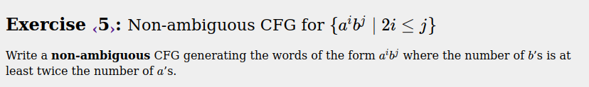
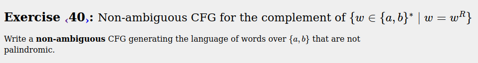

# Ejercicios de CFG

## Ejercicio 1
### Enunciado:


### CFG
```
S -> aSb |
```
## Ejercicio 2
### Enunciado:


### CFG
```
S -> aSb | acb
```

## Ejercicio 3
### Enunciado:


### CFG
```
X -> aXb | S
S -> aS |
```

## Ejercicio 4
### Enunciado:


### CFG
```
X -> aXb | S
S -> Sb |
``` 

## Ejercicio 5
### Enunciado:


### CFG
```
X -> aXbb
X -> S
S -> Sb |
```

## Ejercicio 6
### Enunciado:


### CFG
```
X -> T | aXbb
T -> aT | ab |
```

## Ejercicio 7
### Enunciado:


### CFG
```
X -> T | aXbb
T -> aT | ab |
```
## Ejercicio 8
### Enunciado:


### CFG
```
X -> T | aaXb
T -> aT | ab |
```

## Ejercicio 9
### Enunciado:


### CFG
```
S -> T | Sb
T -> aT | 
```

## Ejercicio 10
### Enunciado:


### CFG
```
X -> aXc | S
S -> aSb | 
```

## Ejercicio 11
### Enunciado:


### CFG
```
T -> XS
X -> aXb | 
S -> bSc | 
```

## Ejercicio 12
### Enunciado:


### CFG
```
S -> X | YC | AZ
X -> aXc | B
B -> bB |
Y -> aYb |
C -> Cc |
Z -> bZc |
A -> aA | 
```

## Ejercicio 13
### Enunciado:


### CFG
```
W -> S | T
T -> Tb | Ta | Sb
S -> aSa | Y
Y -> Xb | b
X -> Xa | Xb | b
```

## Ejercicio 14
### Enunciado:


### CFG
```
S -> aSa | Sb | b
```

## Ejercicio 15
### Enunciado:


### CFG
```
X -> S | M | T
S -> aSa | Tb | Sb | bNb | b
T -> Sb | Ta | Tb
N ->  | Nb | Na
M -> b | Ma | Mb
```

## Ejercicio 16
### Enunciado:


### CFG
```
X -> aXa | bXb | a | b | 
```
## Ejercicio 17
### Enunciado:


### CFG
```
S -> A | B | C
A -> a | aAa | aCa // a o aa
B -> b | bAb// b o ba
C -> bBb | bCb | // bb
```

## Ejercicio 18
### Enunciado:


### CFG
```
S -> aSa | bSb | aBa | bAb
A -> a | aa | aAa
B -> b | bb | bBb
```

## Ejercicio 19
### Enunciado:


### CFG
```
S -> D
A -> aAa | aBa | a | aa
B -> bBb | bCb | bbb | bb
C -> bAb
D -> aCa | bDb | aDa | aba
```

## Ejercicio 20
### Enunciado:


### CFG
```
S -> SS | (S) | 
```

## Ejercicio 21
### Enunciado:


### CFG
```
S -> SS | (S) | [S] | 
```

## Ejercicio 22
### Enunciado:


### CFG
```
S -> (S)S | 
```

## Ejercicio 23
### Enunciado:


### CFG
```
S -> (S)S | [S]S | 
```

## Ejercicio 24
### Enunciado:


### CFG
```
S -> aBS | bAS | 
B -> aBB | b
A -> bAA | a
```

## Ejercicio 25
### Enunciado:


### CFG
```
S -> aSb | bSa | Sc | cS | SS | 
```

## Ejercicio 26
### Enunciado:


### CFG
```
S -> aSc | bSc | cSa | cSb | SS | 
```

## Ejercicio 27
### Enunciado:


### CFG
```
S -> SbSaSbS | SbSbSaS | SaSbSbS | 
```

## Ejercicio 28
### Enunciado:


### CFG
```
S -> aAbS | bBaS | 
A -> aAbA | 
B -> bBaB | 
```

## Ejercicio 29
### Enunciado:


### CFG
```
T -> S | Tc
S -> CADS | DBCS | 
A -> CADA | 
B -> DBCB | 
C -> cC | a
D -> cD | b
```

## Ejercicio 30
### Enunciado:


### CFG
```
S -> TAcS | cCTS | 
A -> TAcA | 
C -> cCTC | 
T -> a | b
```

## Ejercicio 31
### Enunciado:


### CFG
```
S -> bABS | bXS | aBBS | 
B -> aBBB | b
A -> bXA | a
X -> bXX | bA
```

## Ejercicio 32
### Enunciado:


### CFG
```
S -> aSb | c | bS | aTa | cAa
T -> Ta | Sb
A -> | aA
```

## Ejercicio 33
### Enunciado:


### CFG
```
Z -> S | T | BS | SB | BSB | BT | TB | BTB
T -> ABSBA | ABTBA
S -> Ac | cA | AcA | c
A -> aA | a
B -> bB | b
```

## Ejercicio 34
### Enunciado:


### CFG
```
Error 404
```

## Ejercicio 35
### Enunciado:


### CFG
```
S -> B | aSa | bSb
B -> aB | bB |c
```

## Ejercicio 36
### Enunciado:


### CFG
```
S -> aS | bS | B
B -> c | aBa | bBb
```

## Ejercicio 37
### Enunciado:


### CFG
```
S -> C | aSa | aSb | bSa | bSb
C -> aAb | aAa 
A -> aBa | aBb
B -> c | bBb | bBa | bAb | bAa
```

## Ejercicio 38
### Enunciado:


### CFG
```
S -> K | B | A 
K -> Aba | Ba | Ka | Kb
B -> Nb | Bb | b
A -> aN | aA | a
N -> aNb | ab
```

## Ejercicio 39
### Enunciado:


### CFG
```
S -> K | B | A 
K -> Aba | Ba | Ka | Kb
B -> Nb | Bb | b
A -> aN | aA | a
N -> aNb | ab
```

## Ejercicio 40
### Enunciado:


### CFG
```
T -> aPb | bPa | aTb | bTa | aTa | bTb
P -> aPa | bPb | a | b | 
```

## Ejercicio 41
### Enunciado:


### CFG
```
S -> L | M | P | I
B -> bB | 
A -> aBc | aAc // a y c balanceados
X -> bXc | 
Y -> X | aX // b y c balanceados
U -> aUb | 
V -> U | Vc // a y b balanceados

L -> aA | aV | aL // a desbalanceado
M -> Ac | Yc | Mc // c desbalanceado
N -> Ub | Nb // desbalancea ab
O -> bX | bO // desbalancea bc
R -> N | Rc // add c to unbalanced 
Q -> O | aQ // add a to unbalanced
P -> R | Q // b desbalanceada

D -> aD | a | 
E -> D | Eb | 
F -> Ec | Fc

I -> Eba | Fa | Fb | Ia | Ib | Ic
```

## Ejercicio 42
### Enunciado:


### CFG
```
X -> S | T | A | B | 
T -> Db | Ea | Pc | Sc | TL | Tc // mal formato
S -> M | N | AcB | BcA // != sz
M -> LP | LM
N -> PL | NL
P -> c | LPL // = sz
A -> a | AL
B -> b | BL
C -> c | LC
D -> aC | LDL
E -> bC | LEL
L -> a|b
```

## Ejercicio 43
### Enunciado:


### CFG
```
E -> N | EOE | (E)
D -> 0 | 1 | 2 | 3 | 4 | 5 | 6 | 7 | 8 | 9 
N -> D | DN
O -> + | - | * | /
```

## Ejercicio 44
### Enunciado:


### CFG
```
E -> N | NOE | P | POE
P -> (E)
D -> 0 | 1 | 2 | 3 | 4 | 5 | 6 | 7 | 8 | 9 
N -> D | DN
O -> + | - | * | /
```

## Ejercicio 45
### Enunciado:


### CFG
```
S -> M | NCD | TD
T -> B | aTc
N -> aNb | 
M -> BC | aMd
B -> bB | 
C -> cC |
D -> dD |
```