# Ejercicios de DFA

## Ejercicio 1
### Enunciado:
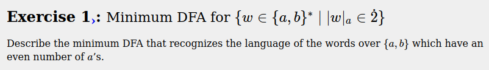

### DFA
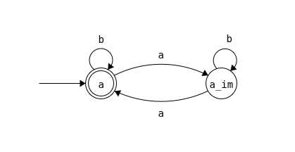

## Ejercicio 2
### Enunciado:
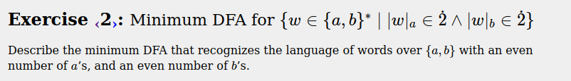

### DFA
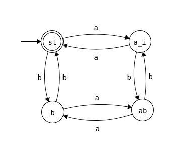

## Ejercicio 3
### Enunciado:
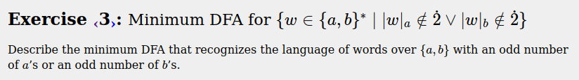

### DFA
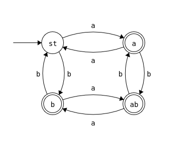

## Ejercicio 4
### Enunciado:

### DFA
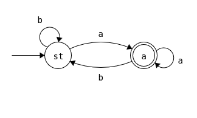

## Ejercicio 5
### Enunciado:

### DFA
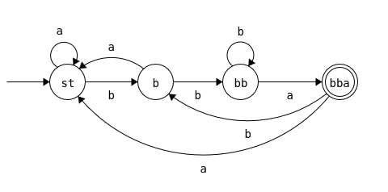

## Ejercicio 6
### Enunciado:

### DFA
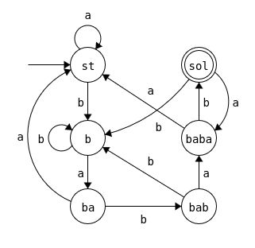

## Ejercicio 7
### Enunciado:
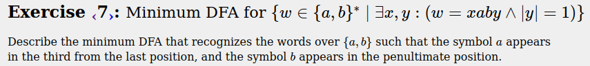

### DFA
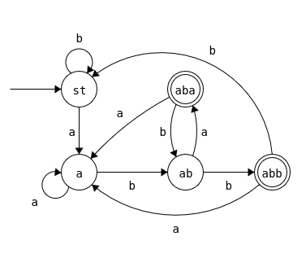

## Ejercicio 8
### Enunciado:
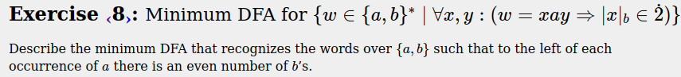

### DFA
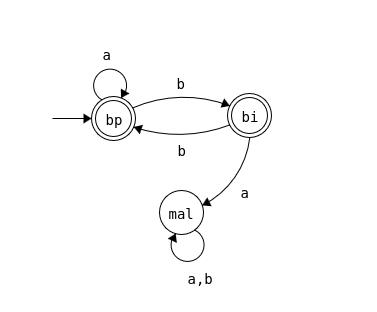

## Ejercicio 9
### Enunciado:
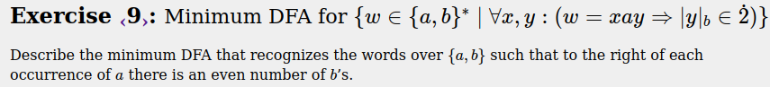

### DFA
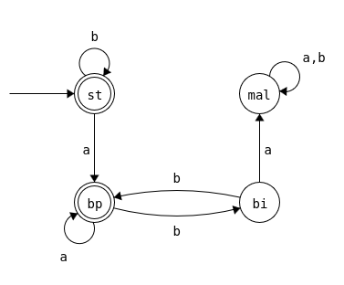

## Ejercicio 10
### Enunciado:
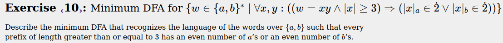

### DFA
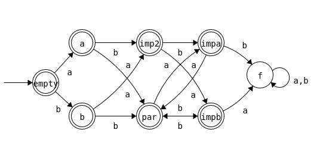

## Ejercicio 11
### Enunciado:
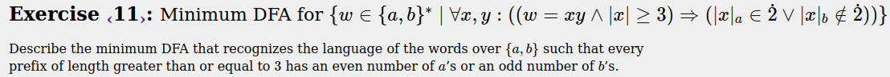

### DFA
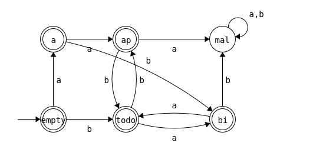

## Ejercicio 12
### Enunciado:
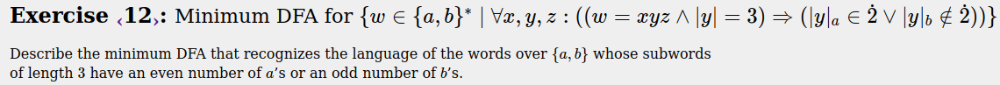

### DFA

## Ejercicio 13
### Enunciado:
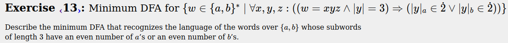

### DFA
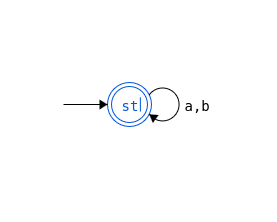

## Ejercicio 14
### Enunciado:
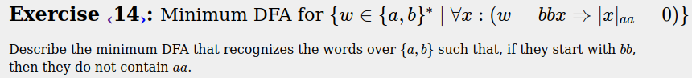

### DFA
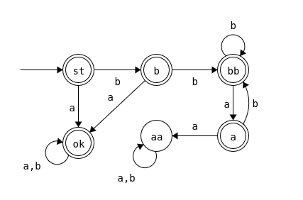

## Ejercicio 15
### Enunciado:
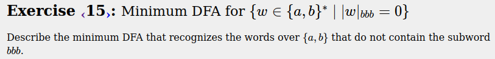

### DFA
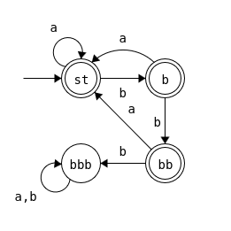

## Ejercicio 16
### Enunciado:
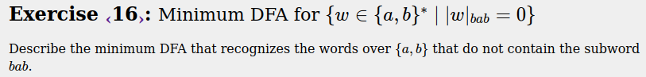

### DFA
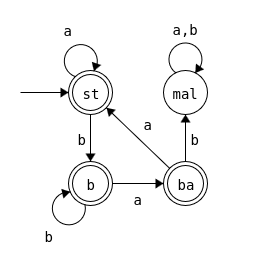

## Ejercicio 17
### Enunciado:
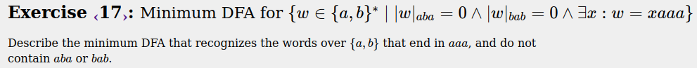

### DFA
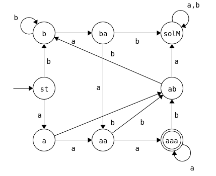

## Ejercicio 18
### Enunciado:
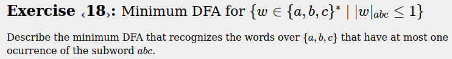

### DFA
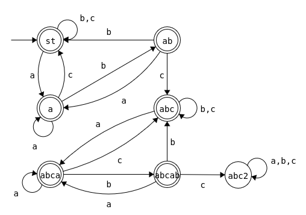

## Ejercicio 19
### Enunciado:
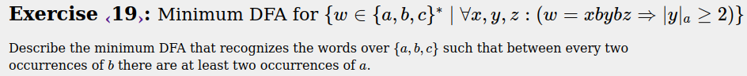

### DFA

## Ejercicio 20
### Enunciado:
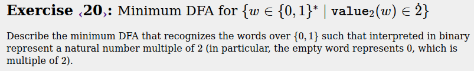

### DFA
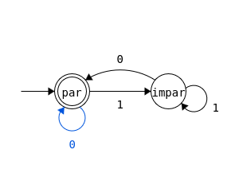

## Ejercicio 21
### Enunciado:

### DFA
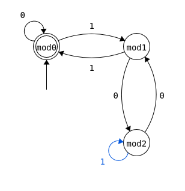

## Ejercicio 22
### Enunciado:
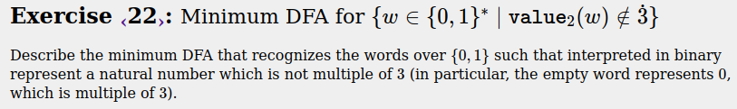

### DFA
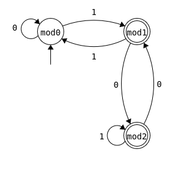

## Ejercicio 23
### Enunciado:
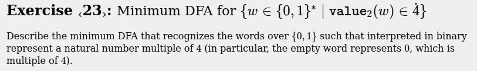

### DFA
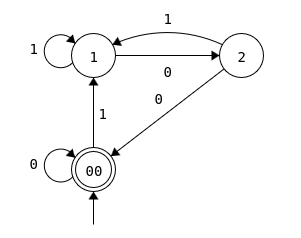

## Ejercicio 24
### Enunciado:

### DFA
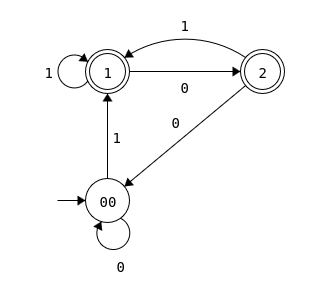

## Ejercicio 25
### Enunciado:
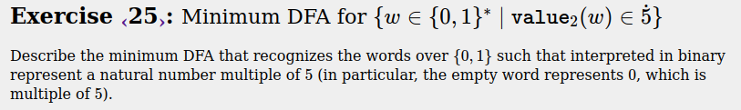

### DFA
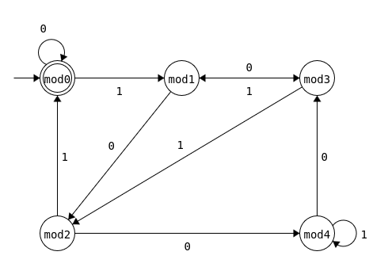

## Ejercicio 26
### Enunciado:
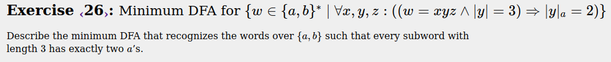

### DFA
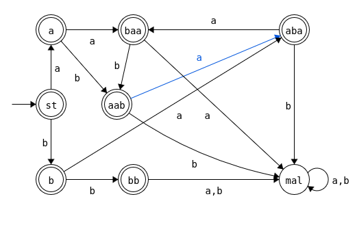

## Ejercicio 27
### Enunciado:

### DFA
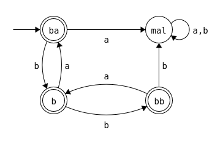

## Ejercicio 28
### Enunciado:
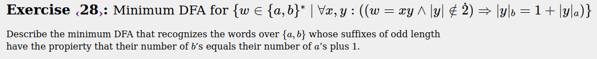

### DFA
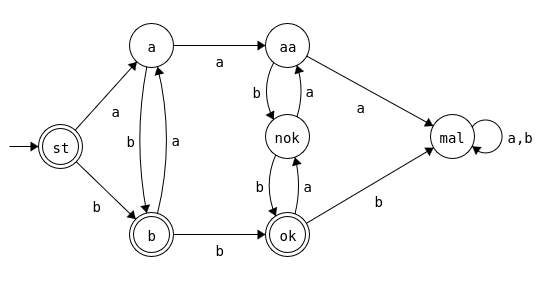

## Ejercicio 29
### Enunciado:

### DFA
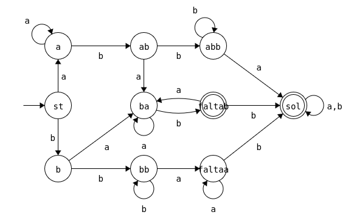

## Ejercicio 30
### Enunciado:

### DFA
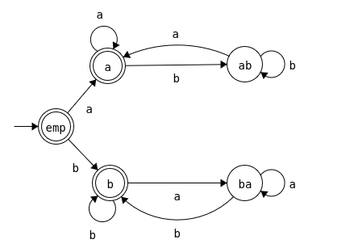

## Ejercicio 31
### Enunciado:

### DFA

## Ejercicio 32
### Enunciado:

### DFA

## Ejercicio 33
### Enunciado:

### DFA

## Ejercicio 34
### Enunciado:

### DFA

## Ejercicio 35
### Enunciado:

### DFA

## Ejercicio 36
### Enunciado:

### DFA

## Ejercicio 37
### Enunciado:

### DFA

## Ejercicio 38
### Enunciado:

### DFA

## Ejercicio 39
### Enunciado:

### DFA

